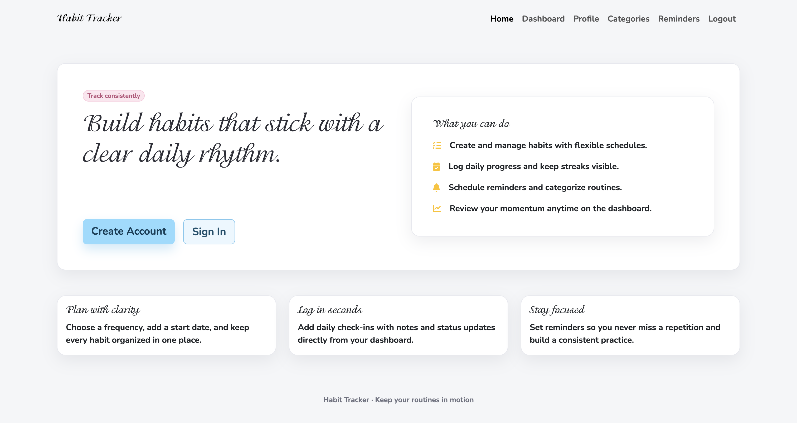
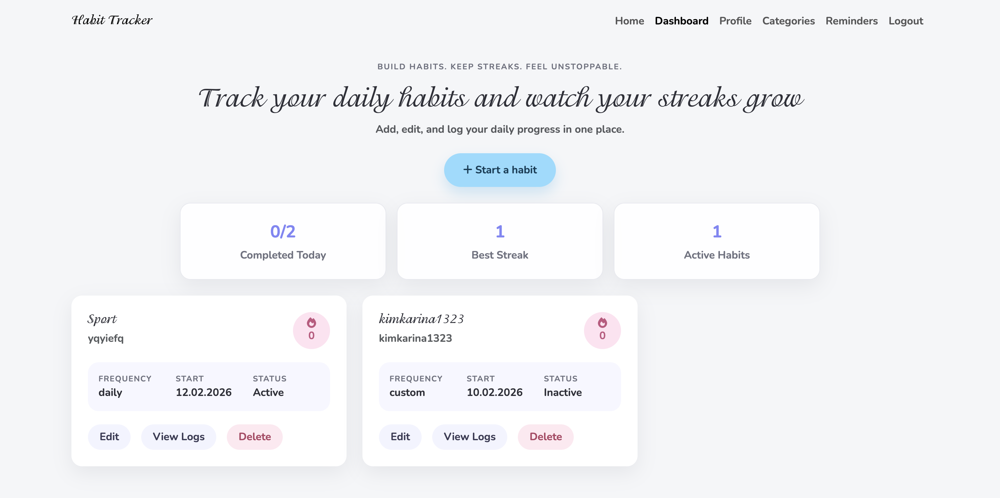
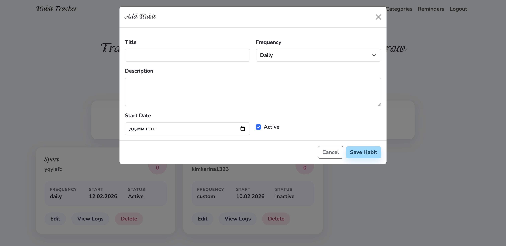
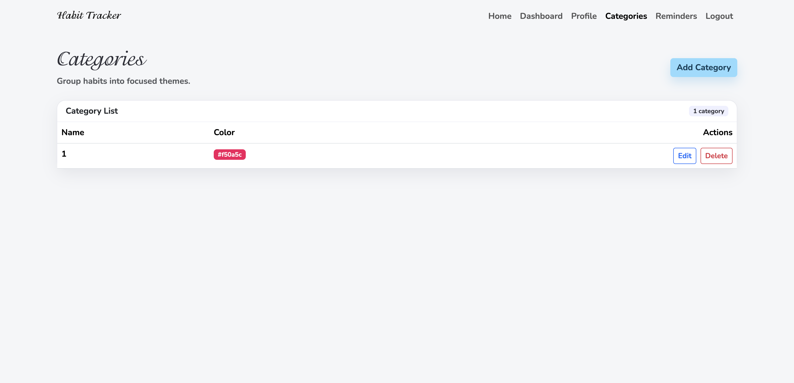
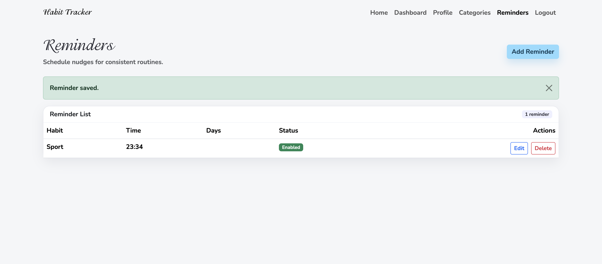

# FINAL PROJECT
## HABIT TRACKER

Students: Samatova Zhanel, Tulegenova Karina

Group: SE-2419

## Project Overview
Habit Tracker is a full-stack project with a Bootstrap-based frontend and a Node/Express backend backed by MongoDB. It supports JWT authentication, profile management, habit tracking, logs, categories, reminders, and role-based access control (RBAC).

## WEB-site appearence






## Setup Instructions
### 1) Backend (Node/Express + MongoDB)
1. Create an `.env` file in `server/` using the template below:
   ```bash
   cp server/.env.example server/.env
   ```
2. Update `server/.env` with your MongoDB URI and JWT secret.
3. (Optional) Set `ADMIN_EMAIL` and `ADMIN_PASSWORD` if you want to seed an admin.
3. Install dependencies and start the API:
   ```bash
   cd server
   npm install
   npm run dev
   ```
4. The API will run on `http://localhost:5001` by default.

### 2) Frontend (Static)
1. Open the `frontend/` folder with a static server (e.g., Live Server).
2. Open `index.html` in the browser.

### Configure API Base URL
By default, the frontend uses `http://localhost:5001/api`. You can override it:
```js
localStorage.setItem("apiBase", "http://localhost:5001/api");
```
Refresh the page after setting.

## API Documentation
Base URL: `http://localhost:5001/api`

### Authentication (Public)
- `POST /auth/register`
  - Body: `{ username, email, password }`
  - Response: `{ token, user }`
- `POST /auth/login`
  - Body: `{ email, password }`
  - Response: `{ token, user }`

### User Management (Private)
- `GET /users/profile`
- `PUT /users/profile`
  - Body: `{ username, email }`

### Habits (Private)
- `GET /habits`
- `GET /habits/stats`
- `POST /habits`
  - Body: `{ title, description?, frequency, startDate?, isActive? }`
- `PUT /habits/:id`
- `DELETE /habits/:id`

### Logs (Private)
- `GET /habits/:id/logs`
- `POST /habits/:id/logs`
  - Body: `{ date, status, note? }`
- `DELETE /logs/:logId`

### Categories (Private)
- `GET /categories`
- `POST /categories`
  - Body: `{ name, color? }`
- `PUT /categories/:id`
- `DELETE /categories/:id`

### Reminders (Private)
- `GET /reminders`
- `POST /reminders`
  - Body: `{ habitId, time, daysOfWeek?, enabled }`
- `PUT /reminders/:id`
- `DELETE /reminders/:id`

## Validation & Error Handling
- Requests are validated using Joi.
- Errors return meaningful status codes (400, 401, 403, 404, 500).
- A global error handler returns JSON error messages.

## RBAC (Role-Based Access Control)
- Roles: `user`, `admin`.
- Users can only modify their own resources.
- Admins can modify/delete any resource.

## Admin Seeding
If you set `ADMIN_EMAIL` and `ADMIN_PASSWORD` in `server/.env`, run:
```bash
cd server
npm run seed:admin
```

## Tests
```bash
cd server
npm test
```

## Test User Flow
1. Register a new account at `frontend/register.html`.
2. Login and land on the dashboard.
3. Add a habit and create a log entry.
4. Add a category and reminder.
5. Logout to clear the JWT.
